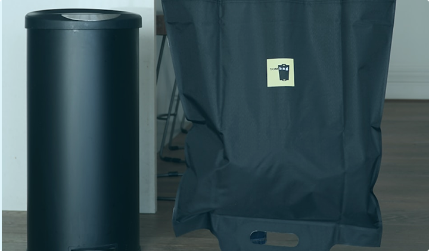

# PALMS Bio Energy



## Project Overview

PALMS Bio Energy is a revolutionary decentralized application (dApp) that transforms organic waste into valuable digital assets on the blockchain. This platform enables users to convert waste products into tokens, track their environmental impact, and participate in a sustainable energy marketplace.

## Features

- **Waste-to-Value Conversion**: Convert organic waste into tokenized assets on the Starknet blockchain
- **Environmental Impact Tracking**: Monitor your carbon footprint reduction and positive environmental contributions
- **Energy Asset Management**: Manage and trade your bio-energy assets in a decentralized marketplace
- **Gas Production Analytics**: Track biogas production rates and efficiency metrics
- **Rewards System**: Earn rewards for your sustainable contributions to the ecosystem
- **Admin Dashboard**: Comprehensive management tools for project administrators

## Technology Stack

- **Frontend**: React 18, TailwindCSS
- **Blockchain**: Starknet
- **React Frameworks**: 
  - React Router for navigation
  - Starknet React for blockchain interaction
- **UI Components**: Custom components with responsive design

## Getting Started

### Prerequisites

- Node.js (v16 or higher)
- npm or yarn
- A Starknet wallet (Argent X, Braavos, etc.)

### Installation

1. Clone the repository:
   ```bash
   git clone https://github.com/yourusername/palms-dapp.git
   cd palms-dapp
   ```

2. Install the dependencies:
   ```bash
   npm install
   ```

3. Start the development server:
   ```bash
   npm run dev
   ```

4. Open your browser and navigate to `http://localhost:5173` (or the port shown in your terminal)

## Project Structure

- `/src` - Main source code directory
  - `/assets` - Images, icons, and SVG files
  - `/components` - Reusable UI components
  - `/pages` - Application pages
    - `/dashboard` - Dashboard views and components
    - `/dashboard/admin-ui` - Admin interface components
  - `/App.jsx` - Main application component
  - `/main.jsx` - Application entry point

## Available Scripts

- `npm run dev` - Start the development server
- `npm run build` - Build the production-ready application
- `npm run lint` - Run ESLint to check code quality
- `npm run preview` - Preview the production build locally

## Connecting a Wallet

The application supports various Starknet wallets including:
- Argent X
- Braavos
- MetaMask (with Starknet extension)

Navigate to the "Connect Wallet" page and select your preferred wallet provider to get started.

## How It Works

1. **Biogas Production**: Organic waste is processed through bio-digesters, producing methane-rich biogas
2. **Energy Generation**: The biogas is used to generate clean electricity
3. **Blockchain Integration**: Energy production data is recorded on the Starknet blockchain
4. **Tokenization**: Energy contributions are tokenized as digital assets
5. **Marketplace**: Users can trade or stake their energy tokens in the marketplace

## Contributing

Contributions are welcome! Please feel free to submit a Pull Request.

1. Fork the repository
2. Create your feature branch (`git checkout -b feature/amazing-feature`)
3. Commit your changes (`git commit -m 'Add some amazing feature'`)
4. Push to the branch (`git push origin feature/amazing-feature`)
5. Open a Pull Request

## License

This project is licensed under the MIT License - see the LICENSE file for details.

## Contact

Your Name - [@your_twitter](https://twitter.com/your_twitter) - email@example.com

Project Link: [https://github.com/yourusername/palms-dapp](https://github.com/yourusername/palms-dapp)

## Acknowledgments

- [Starknet](https://starknet.io/) - Layer 2 Ethereum scaling solution
- [React](https://reactjs.org/) - JavaScript library for building user interfaces
- [TailwindCSS](https://tailwindcss.com/) - Utility-first CSS framework